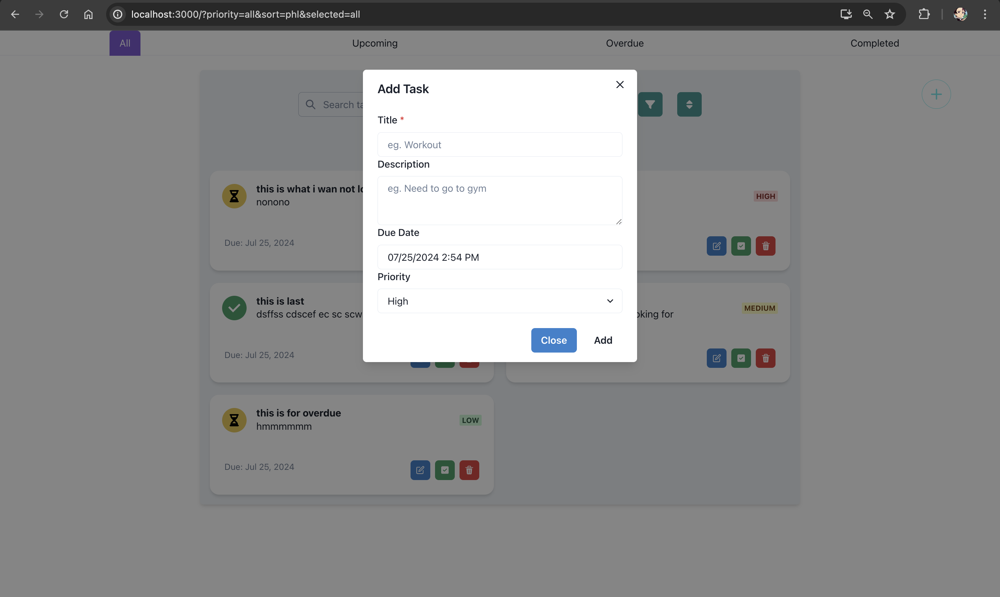
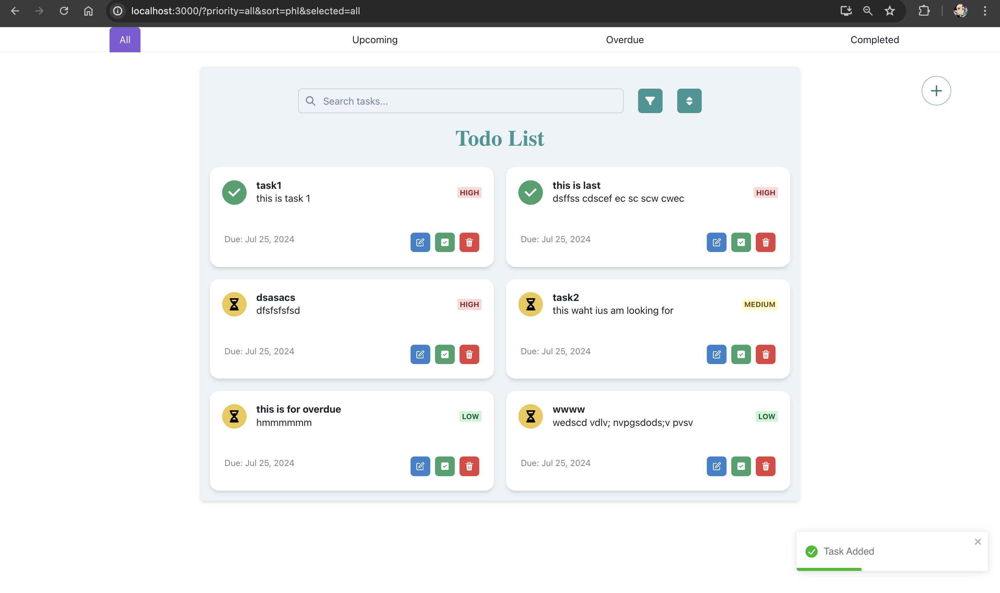
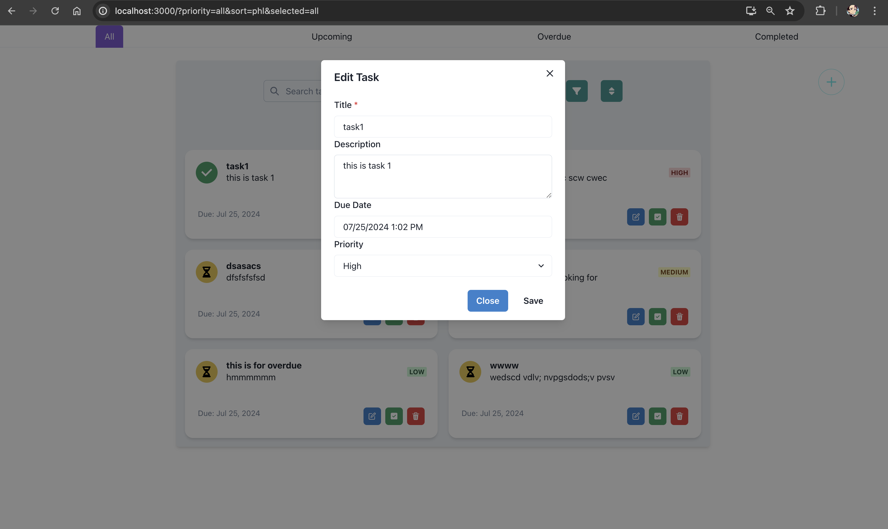
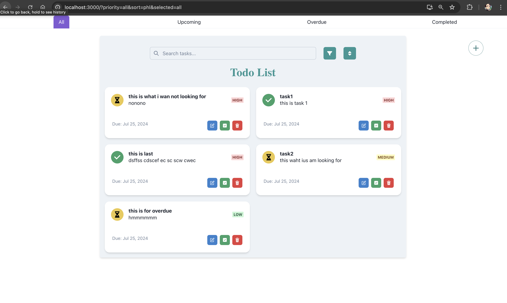
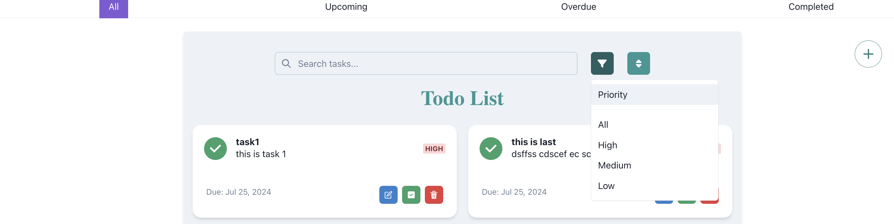

# To-do App

Demo Link: https://elitefit-todo-delta.vercel.app/

# Features:

**Task Add**

User will get the following feedback after the task created

**Edit Task**

**Task Card**

The Task will show task title, priority level, Due Date, descrption and allow user to **update, delete or complete Task**

**Task Status**

Icon the left indicated the task status, as colour suggest, red is for overdue, green for completed, yellow is for overdue

The complete task can not be editied

**Select Task based on status and Search For task**

- User can select the cateogry of task from the above navbar
- User can search the task based on title or description from the search bar

**Sort and Filter the task**

User can sort and filter the task based on priority and dates

# Local Setup

Make sure you have the following installed on your machine:

- Node.js: [Download Node.js](https://nodejs.org/)
- Git: [Download Git](https://git-scm.com/)

For local setup first clone the github repo

`
git clone https://github.com/sandeeppatel2001/Elitefite-AI-ToDo
`

Navigate to project directory

`
cd Elitefit-AI-ToDo
`

Install Dependencies
`
npm install
`

Run the application

`
npm start
`